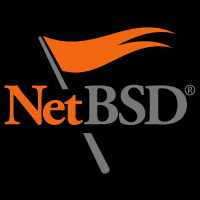

# CI/CD GNU Screen on NetBSD

[](https://github.com/alexander-naumov/gnu-screen-on-netbsd/actions/workflows/netbsd_9_2_x86_64.yml)
[](https://github.com/alexander-naumov/gnu-screen-on-netbsd/actions/workflows/netbsd_9_3_x86_64.yml)
[](https://github.com/alexander-naumov/gnu-screen-on-netbsd/actions/workflows/netbsd_10_0_x86_64.yml)
[](https://github.com/alexander-naumov/gnu-screen-on-netbsd/actions/workflows/netbsd_10_0_aarch64.yml)



This project builds the NetBSD VM image for the
[cross-platform-actions/action](https://github.com/cross-platform-actions/action)
GitHub action and build GNU Screen on it.
The image contains a standard NetBSD installation without any
X components. It will install the following distribution sets:

* Kernel (GENERIC)
* Kernel modules
* Base
* Configuration files
* Compiler tools
* X11 base and clients
* X11 programming
* X11 configuration
* X11 fonts
* X11 servers

In addition to the above file sets, the following packages are installed as well:

* bash
* curl
* pkgin
* rsync
* sudo
* git
* autoconf
* automake
* gmake

Except for the root user, there's one additional user, `runner`, which is the
user that will be running the commands in the GitHub action. This user is
allowed use `sudo` without a password.

## Architectures and Versions

The following architectures and versions are supported:

| Version | x86-64 | aarch64 |
|---------|--------|---------|
| 9.2     | ✓      |         |
| 9.3     | ✓      |         |
| 10.0    | ✓      | ✓       |

## Building Locally

### Prerequisite

* [Packer](https://www.packer.io) 1.7.2 or later
* [QEMU](https://qemu.org)

### Building

1. Clone the repository:
    ```
    % git clone https://github.com/cross-platform-actions/netbsd-builder
    % cd netbsd-builder
    ```

2. Run `build.sh` to build the image:
    ```
    % ./build.sh <version> <architecture>
    ```
    Where `<version>` and `<architecture>` are the any of the versions or
    architectures available in the above table.

The above command will build the VM image and the resulting disk image will be
at the path:
`output/netbsd-9.2-x86-64.qcow2`.

3. Get the GNU Screen source code from the devel repository and build it:
    ```
    % uname -a
    % cc -v
    % git -c http.sslVerify=false clone https://github.com/alexander-naumov/gnu-screen.git
    % cd gnu-screen/src
    % ./autogen.sh

    % cc=gcc ./configure CFLAGS="-Wall -DDEBUG"
    % gmake
    % ./screen -v
    % ./screen -ls || echo $?
    % ./screen --help
    % gmake clean

    % cc=clang ./configure CFLAGS="-Wall -DDEBUG"
    % gmake
    % ./screen -v
    % ./screen --help
    ```

## Additional Information

The qcow2 format is chosen because unused space doesn't take up any space on
disk, it's compressible and easily converts the raw format.
